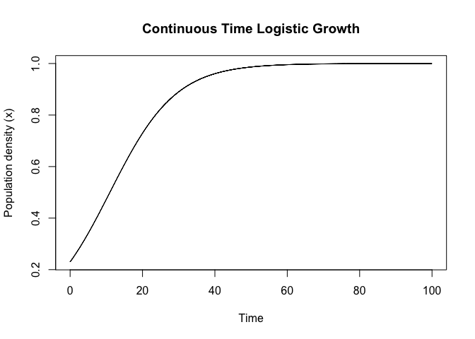

Continuous time logistic model
================

### Assumption :

(only some important ones)

- Time is continuous.
  - $t \in \mathbb{R}_{\ge 0}$
- Mean field
  - $N_t$ is large
  - $N_t$ is expected population size at time $t$.
- No age, sex structures.
- Birth and deaths are uniformly distributed over a small time interval
  $\Delta t$.
  - Ideally $\Delta t \to 0$ but we have to set it to some small number
    for computations.
  - $b_t$ is per capita birth rate density at time $t$.
  - $b_t \Delta t$ is birth rate for the small interval $\Delta t$.
  - similarly $d_t$ is per capita birth rate density.
- Only births and deaths can change the population.
  - Therefore $r_t = b_t - d_t$ is growth rate at time $t$.
- Growth rate decreases linearly as $N_t$ increases.
  - we assume $r_t = r_m(1 - N_t/K)$

  - Where $K$ is called carrying capacity as population will start
    decreasing when $N_t > K$.

  - and $r_m$ is max growth rate population can have, i.e. when
    $N_t = 0$
- Biological meaningfulness
  - $N_t > 0$

  - state space $E = \mathbb{R}_{\ge 0}$
- Note: Non-overlapping generation assumption from discrete time model is not needed here.

------------------------------------------------------------------------

Cont**inuous Logistic model :**

Let $x_t = N_t /K$, And let $\Delta x_t = x_{t+\Delta t} - x_t$, where
$\Delta t$ is very small.

$\implies$

$$\Delta x_t \approx r_t\Delta t \cdot x_t$$\$$

$\implies$

$$\dfrac{x_{t+ \Delta t} − x_t}{\Delta t} \approx r_m x_t (1 - x_t)$$

and equality holds as $\Delta t \to 0$ so taking limit both sides and
let $f(t) = x_t = x(t)$ \<- we will use any of these as equivalent
notaion:

$\implies$

$$\boxed{\frac{d}{dt}x(t) = r_m x_t(1-x_t)}$$

**Note :**

- Unlike discrete model, $N_t$ can grow beyond $K$ as $r$ can take
  negative values.

<!-- -->

- In discrete model we took $R_t = 1 + b_t - d_t$ in linearly decreasing
  where in continuous model we are taking $b_t - d_t$ decreasing
  linearly with $N_t$.

- Therefore $r_t$ can meaningfully take negative values.; so does $r_m$.
  And $r_m < 0 \implies K < 0$.

  $$r_m, K \in \mathbb{R}$$

- But $x > 0$ and $x = \frac {N}{K}$ so $x$ is meaningfully fraction of
  carrying capacity only for $K >0$. Aslo, $K <0$ is not even in state
  space so in this case we shall not interpret it as carrying capacity.
  Hence interpretations shall be treated with care.

- Unlike discrete model, $x$ has no upper bound in continuous case.

------------------------------------------------------------------------

#### Stability

- One can clearly see that system is stable when $r_t = 0$ or $x =0$.

- $r_t = 0$ when $r_m = 0$ or $x_t = 1$ i.e. $N_t = K$.

- One can do simple calculations of linear stability test and get the
  stability structure.

- $x^\ast = 0$ stable for $r_m \le 0$ otherwise unstable.

- $x^\ast = K$ stable for $r_m \ge 0$ , and for $r_m < 0$, $K < 0$ is
  not even in state space so irrelavent here.

------------------------------------------------------------------------

### Simullation:

> I have used Euler discretization of $\dot{x} = rx(1-x)$

$$x_{t+\Delta t} = x_t + r_m (1−x_t) x_t \Delta t$$

``` r
trajectory = logistic_growth(x0 = 0.23, r = 0.11, delta_t = 0.01, 
                             t_max = 100)
plot(trajectory$time, trajectory$x, type = "l", xlab = "Time", ylab = 
     "Population density (x)", main = "Continuous Time Logistic Growth")
```

<!-- -->
