# README

## Population dynamics in presence of harvester.

Suppose a population in absence of harvester grows logistically, and we
introduce a harvester, for example let grass be the population we are
tracking and introduce the cattle as harvester; and suppose the
population growth in absence of harvester is logistic in continuous time
then we can write the new growth equation as following:
$$\dot N = r_m N (1 - N/K) - H(N)$$

where $H(N)$ is overall harvesting rate and depends on what type of
dynamics we are considering here. For example in some case harvester is
only depend on population for the resources then as population decreases
harvester numbers decrease as well. Whereas in some other cases,
harvester may have some other resources as well and may not decrease
with population.

I have considered some standard harvester functions here :

- Type 0 (constant) : $H(N) = c$

- Type I (linear): $H(N) = h_0 N$

- Type II (saturating): $H(N) = \dfrac{h_0 N}{N_0 + N}$

- Type III (sigmoidal):
  $H(N) = \frac{h_0 N^\theta}{N_0^{\theta} + N^{\theta}}$

Here $h_0$ is intrinsic harvesting rate, $N_0$ is half saturation point
i.e. at $N = N_0$, harvesting rate is exactly half of its intrinsic
harvesting constant.

Rescaling, $x = N/K$

------------------------------------------------------------------------

For simulations I considered Euler-discretization:

$$x_{t+\Delta t} = x_t  + [r_m(1−x_t )x_t  − H(x_t )] \Delta t$$

------------------------------------------------------------------------

Here is the example plot of trajectory generated from Harvester
functions,

``` r
Traj = Popn_trajectory_holling(x_init = 0.1, r_m = 0.7, delta_t = 0.01,
                               t_max = 100, harvest_type = 3,
                               h0 = 0.3, x0 = 0.23, theta = 2)

plot(Traj$time, Traj$x, type = "l", xlab = "Time", ylab = 
       "Population density (x)", main = "Logistic Growth with Holling 
     Type III Harvesting, theta = 2", cex.main = 0.7)
```

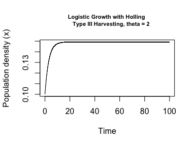

------------------------------------------------------------------------

### Equilibrium and stability.

Let $f(x) = \dot x = r_mx(1-x) - H(x)$, then we have equilibrium at
point $x^\ast$ if $f(x^\ast) =0$. From linear stability test (LST),

- $f'(x^\ast) \gt 0 \implies$ Unstable equilibrium

- $f'(x^\ast) \lt 0 \implies$ Stable equilibrium.

Note: Since population density cannot be negative, $x=0$ is treated as
an absorbing extinction state. Once the population reaches $x=0$, it
remains there. For harvesting functions where $H(0)=0$ (Types 1, 2, 3),
$x=0$ is already an equilibrium of the continuous model. For Type $0$
harvesting, $H(0)=c \gt 0$, so $x=0$ is not an equilibrium of the
unconstrained differential equation; it becomes an absorbing state only
after imposing the biological boundary at extinction.

------------------------------------------------------------------------

**Holling type** $\mathrm{I}$ **:** $H(x) = h_0 x$

$$f(x)=x[r_m (1−x)−h_0 ]$$

Stability: $f′(x)=r_m (1−2x)−h_0$

Equilibria at

1)  $x_0 ^\ast = 0,$ and
    $f′(0)=r_m  − h_0  \implies x_0 ^\ast \text{ stable if } h_0 > r_m$

2)  $x_1 ^ \ast = 1 - \frac{h_0}{r_m},$ for $x_1 ^\ast \ge 0$, otherwise
    NBS. and
    $f′(x_1 ^\ast  ) = h_0  - r_m  \implies \text{ stable for } h_0 < r_m$.

Note: At $h_0=r_m$, the linear stability test is inconclusive because
$f'(0)=0$. However, from the nonlinear equation $\dot x = -r_m x^2$, we
see that $x=0$ is asymptotically stable for $x\geq 0$.

we have, $$\frac{d}{dt} \Delta x \approx  f'(x) \Delta x$$

Then, The characteristic relaxation timescale near a stable equilibrium
is $\tau=1/|f'(x^ \ast)|$. As $f'(x^ \ast) \to 0$, this timescale
diverges, a phenomenon known as critical slowing down in phase
transition.(I will upload more about it soon. `work in progress`)

**Bifurcation diagram** : $h_0$ is already per-capita (same units as
$r_m$), so $x = N/K_0$ alone makes the model dimensionless — no
rescaling of $h_0$ is needed, and we plot equilibria against raw $h_0$.

------------------------------------------------------------------------

**Holling type** $\mathrm{II}$ **:** $H(N) = \dfrac{h_0 N}{N_0 + N}$

$$\frac{dN}{dt} = r_m N\left( 1 - \frac{N}{K_0}\right) - \frac{h_0N}{N_0 + N}$$

Rescaling : $y = \frac{N}{N_0}$, $h = \frac{h_0/r_m}{N_0}$ and
$k = \frac{K_0}{N_0}$.

Here $N_0$ and $h_0$ are independent choices that determines the harvest
rate.

- $y$ : fraction of population w.r.t. half saturation constant.

- $h$ : measuring harvest rate in terms of intrinsic growth rate $r_m$.

- $k$ : measuring carrying capacity in terms of half saturation
  constant.

- We rescale time as $t' = r_m t$ then $dt' = r_m dt$

So, we get the equation :

$$\frac{dy}{dt'} = y\left( 1 - \frac{y}{k}\right) - h\left( \frac{y}{1+y}\right) $$

Note: $h_0$ is max harvesting rate of entire population (not per capita,
$H \to h_0$ as $N \to \infty$). And $r_m$ is max per capita growth rate.
so $h_0/N_0$ and $r_m$ have same units and therefore $h$ is
Non-dimensional variable and so does $y$ and $k$. we plot equilibria of
$y$ against the dimensionless $h$ for bifurcation diagram.

**Equilibrium and stability :** we can solve equation
$\frac{dy}{dt'} = 0$ and find the fixed points and their stability or
even graphically analyse the intersection points of curves
$y\left( 1 - \frac{y}{k}\right)$ and $h\left( \frac{y}{1+y}\right)$ as
equilibrium points. We get 1 , 2, or 3 equilibrium points depending on
given values of parameters. Further we can analyse stability structure
from graphs easily. (We get fold bifurcation diagram for $k>1$).

------------------------------------------------------------------------

**Holling type** $\mathrm{III}$ : Dimensions and meaning of parameters
is same as for type $\mathrm{II}$ function with one extra parameter
$\theta$.

Rescaled form of this functional is

$$\frac{dy}{dt'} = y\left( 1 - \frac{y}{k}\right) - h \frac{y^ \theta}{1 + y^ \theta}$$

Note : For $\theta = 1$ we get holling type $\mathrm{II}$ functional.

------------------------------------------------------------------------

### Numeric calculations for equilibrium and stability :

To find equilibria of $\dot y = f(y)$ (or $\dot x = f(x)$ for Type I),
we can moslty solve equation algebraically, but that would be difficult
for the computer; so we find it numerically. In
`Equilibria_and_stability.R` we search for the roots on a grid. Here are
key ideas of code explained.

1.  **Grid :** Choose a grid over the range of interest ( $x\in[0,1]$
    for Type $\mathrm{I}$ and $y \in[0, k]$ for Types
    $\mathrm{II}, \mathrm{III}$) and evaluate $f$ at every grid point.

2.  **Scan for sign changes :** By the IVT (Intermediate Value Theorem),
    if $f$ changes sign on consecutive grid points, a root of $f=0$ lies
    between them.

    - This method can not detect when $f$ has a tangential root, and
      this is exactly why equilibrium points will disappear as the
      approach saddle node bifurcation point, as we can see some of
      following graphs.

3.  **Find exact root :** For every sign change, we use a root-finder
    (`uniroot`) restricted to that small bracket to get precise
    equilibrium point. (note: `uniroot()` can find one root at a time so
    we can not use it over general $[0, k]$ domain as $f$ can have up to
    3 roots for Types $\mathrm{II}, \mathrm{III}$)

4.  **Classify stability :** At each equilibrium, approximate
    $f'(x^\ast)$ numerically by central difference,
    $$f'(x^\ast) \approx \frac{f(x^\ast + \Delta x) - f(x^\ast - \Delta x)}{2\Delta x},\ \ \Delta x \text{ is very small}.$$

5.  **Bifurcation diagram :** we plot equilibrium points against
    parameter (e.g. $h_0$ for Type $\mathrm{I}$, $h$ for Types
    $\mathrm{II}, \mathrm{III}$). Showing how equilibria appear,
    disappear, or collide (fold points) as harvesting pressure
    increases.

------------------------------------------------------------------------

### Bifurcation diagrams :

Here are some plots generated from the code:

**Holling type** $\mathrm{0}$

``` r
plot_bifurcation(f0, var_param = "c",
                 range_param = seq(0, 1, by = 0.01),
                 params = list(r_m = 1.5), I_min = 0,
                 I_max = 2)
```

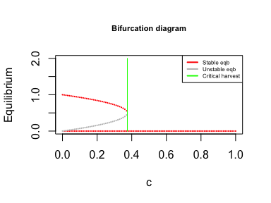

Observations :

- we have saddle node bifurcation at $h_c = \dfrac{r_m}{4}$.

------------------------------------------------------------------------

**Holling type** $\mathrm{I}$

``` r
plot_bifurcation(f1, var_param = "h_0",
                 range_param = seq(0, 4, by = 0.01),
                 params = list(r_m = 1.5), I_min = 0,
                 I_max = 2)
```

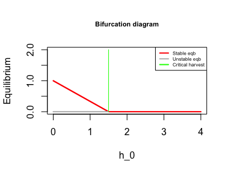

Observations :

- $h_c = r_m$

------------------------------------------------------------------------

**Holling type** $\mathrm{II}$

Note: keep $\mathrm{I}_{max} \ge k$ to prevent graph cutoff.

``` r
plot_bifurcation(f23, var_param = "h",
                 range_param = seq(0, 1.5, by = 0.01),
                 params = list(k = 1.8, theta = 1), I_min = 0,
                 I_max = 2)
```

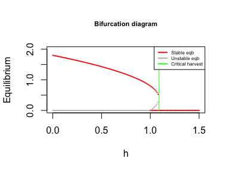

Observations:

- $h_c = \dfrac{(1+k)^2}{4k}$

------------------------------------------------------------------------

**Holling type** $\mathrm{III}$

``` r
plot_bifurcation(f23, var_param = "h",
                 range_param = seq(0, 40, by = 0.1),
                 params = list(k = 5, theta = 2), I_min = 0,
                 I_max = 5)
```

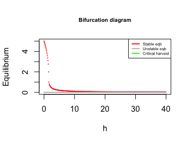

**Some more graphs:**

``` r
parameter_sets = data.frame(
  k = c(5, 5, 5, 10, 10, 10, 10, 20, 20),
  theta = c(3, 4, 5, 2, 3, 4, 5, 3, 5)
)

# Loop through each (k, theta) combination
for (i in 1:nrow(parameter_sets)) {
  
  k_i = parameter_sets$k[i]
  theta_i = parameter_sets$theta[i]
  
  plot_bifurcation(f23, var_param = "h", range_param = seq(0, 20, by =                   0.1), params = list( k = k_i, theta = theta_i),                       I_min = 0, I_max = k_i)
  
  title( main = paste("Holling Type III:","k =", k_i,", theta =",
                     theta_i), adj = 0, line = 0.5, cex.main = 0.5)
}
```

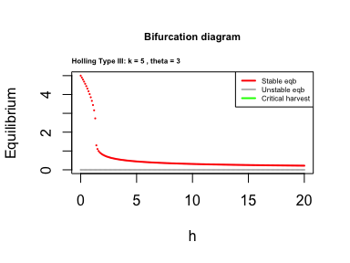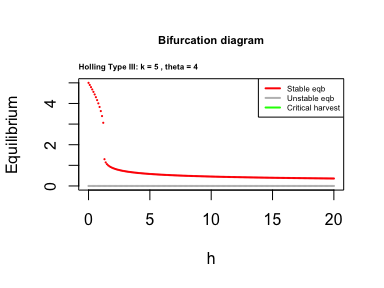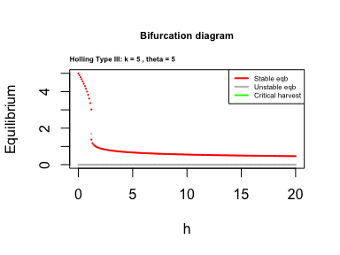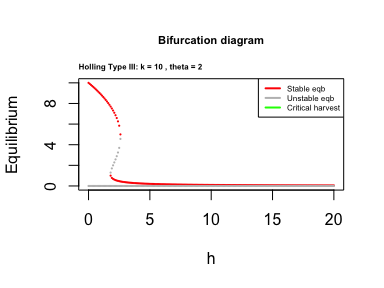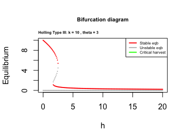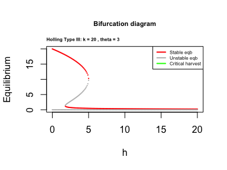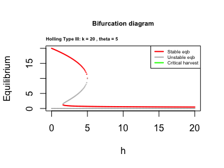

**Observations : `work in progress`**

- Due to we only detect roots when $f$ changes sign, the code is blind
  to tangential roots and I am working on it.

- Also working on $h_c$ . I will update it soon.

------------------------------------------------------------------------

------------------------------------------------------------------------
