# README

# Two species population dynamics

------------------------------------------------------------------------

- We have two species in the system, affecting each others growth rate
  due some factors such as dependence on common resources.

- **State variable** **:** $(N_1, N_2)$.

- **State space** **:** $E = \mathbb{R}^2_{\ge 0}$ (as we are
  considering continuous model.)

- **General form of dynamic function** **:** $f : E \to \mathbb{R}^2$
  s.t. $f = (f_1, f_2)$ where

  $$\dfrac{dN_1}{dt} = f_1(N_1, N_2),$$

  $$\dfrac{dN_2}{dt} = f_2(N_1, N_2).$$

- **Fixed point :** $(N_1^ \ast, N_2^ \ast)$ s.t.

  $$f_1(N_1^ \ast, N_2^ \ast) = 0 ,$$

  $$f_2(N_1^ \ast, N_2^ \ast) =0.$$

- The Jacobian at $(N_1^ \ast, N_2^ \ast)$: (For stability analysis)

$$\mathbf{J}_f (N_1^ \ast, N_2^ \ast) = \begin{bmatrix}
      \frac{\partial f_1} {\partial N_1} & \frac{\partial f_1} {\partial N_2} \\
      \frac{\partial f_2} {\partial N_1} & \frac{\partial f_2} {\partial N_2}
  \end{bmatrix}$$

- Let $\lambda_1, \lambda_2 \in \text{ Spec}(\mathbf{J})$

- **Stability analysis :**

  > **Hyperbolic Systems** $\text{Re}(\lambda) \not = 0$**:** Linear
  > terms act as the dominant force. The linearized system reliably
  > determines the true stability of the non-linear system.

  > **Non-Hyperbolic Systems** $\text{Re}(\lambda) = 0$**:** Linear
  > forces are completely neutral. Linearization fails, and higher-order
  > non-linear terms must be analyzed to determine stability.

  > Note: since this is $2 \times 2$ matrix, **complex eigenvalues will
  > appear in conjugate pair**, so enough to check real part of any one
  > eigenvalue.

  > To avoid floating-point noise we use small tolerances like $1e-8$
  > instead of strict $0$.

+------------------------+--------------------+---------------------+
| Eigenvalue Condition   | Classification\    | Phase Portrait      |
|                        | (ref : Strogatz)   | Stability           |
+:=======================+:===================+:====================+
| Complex with Re(λ) < 0 | **Stable Spiral**  | Asymptotically      |
|                        |                    | Stable              |
+------------------------+--------------------+---------------------+
| Complex with Re(λ) > 0 | **Unstable         | Unstable            |
|                        | Spiral**           |                     |
+------------------------+--------------------+---------------------+
| Complex with Re(λ) = 0 | **Center**         | Lyapunov Stable     |
|                        |                    |                     |
|                        | (Or other          | (Or Inconclusive)   |
|                        | non-hyperbolic     |                     |
|                        |                    |                     |
|                        | curves as          |                     |
|                        | non-linear terms   |                     |
|                        |                    |                     |
|                        | take over;         |                     |
|                        | linearization      |                     |
|                        | fails)             |                     |
+------------------------+--------------------+---------------------+
| Real and both λ < 0    | **Stable Node**    | Asymptotically      |
|                        |                    | Stable              |
+------------------------+--------------------+---------------------+
| Real and both λ > 0    | **Unstable Node**  | Unstable            |
+------------------------+--------------------+---------------------+
| Real with opposite     | **Saddle Point**   | Unstable            |
| signs (λ1 > 0, λ2 < 0) |                    |                     |
+------------------------+--------------------+---------------------+
| At least one λ = 0     | **Non-hyperbolic** | Inconclusive\       |
|                        |                    | Needs nonlinear     |
|                        | (linearization     | terms               |
|                        | fails;             |                     |
|                        |                    |                     |
|                        | non-linear terms   |                     |
|                        | take over)         |                     |
+------------------------+--------------------+---------------------+
| λ1 = λ2 ≠ 0 and        | **Degenerate       | λ < 0 :             |
|                        | node**             |                     |
| A is not               |                    | :   Asymptotically  |
| diagonalizable.        |                    |     Stable          |
|                        |                    |                     |
|                        |                    | λ > 0 :             |
|                        |                    |                     |
|                        |                    | :   Unstable        |
+------------------------+--------------------+---------------------+
| λ1 = λ2 ≠ 0 and        | **Star node**      | λ < 0 :             |
|                        |                    |                     |
| A is diagonalizable.   |                    | :   Asymptotically  |
|                        |                    |     Stable          |
|                        |                    |                     |
|                        |                    | λ > 0 :             |
|                        |                    |                     |
|                        |                    | :   Unstable        |
+------------------------+--------------------+---------------------+

Note : Classification on generated graphs below may be incorrect in case
of any $Re(\lambda) = 0$. Also, for simplicity, In the code I have
classified degenerate node and star node plainly as stable and unstable
nodes accordingly.

------------------------------------------------------------------------

------------------------------------------------------------------------

## 1. Lotka-Volterra competition model

**Story:**

Let us consider population of two species SP1 and SP2 with population
sizes $N_1$ and $N_2$ and assume that both populations grows
logistically i.e. They have intrinsic population growth rate $r_1, r_2$
and $K_1, K_2$ be carrying capacity in absence of other species. Then we
have two growth equations :

$$\dfrac{dN_1}{dt} = r_1 N_1 \left( 1 - \frac{N_1}{K_1} \right) - \text{growth decay due to interspecific competition}$$

$$\dfrac{dN_2}{dt} = r_2 N_2 \left( 1 - \frac{N_2}{K_2} \right) - \text{growth decay due to interspecific competition}$$

Lets consider a simple competition structure as below:

1.  For intraspecific competition we have (logistic growth)

$$\frac{1}{N_1} \frac{dN_1}{dt} \bigg\vert_{\text{intra}} = r_1 -\frac{r_1}{K_1} N_1$$

Here growth rate starts from the intrinsic rate $r_1$ ​ and each unit of
$N_1$​ add linear drag i.e. subtracts $r_1/K_1$ from the per-capita rate.
Where $K_1$ is number of SP1 individuals that alone can reduce SP1’s per
capita growth rate to $0$. On the same note, lets assume SP2 impose
additional linear drag on per capita growth rate, i.e.

$$\frac{1}{N_1} \frac{dN_1}{dt} \bigg\vert_{\text{inter}}= -\frac{r_1}{K'_1} N_2$$

Combining both effect we get :

$$\frac{1}{N_1} \frac{dN_1}{dt} = r_1 \left( 1 -  \frac{N_2}{K'_1} - \frac{N_1}{K_1}\right)$$

Here $K'_1$ is number of SP2 individuals that alone can reduce SP1’s per
capita growth rate to $0$.

Let $\alpha_{21} = \frac{K_1}{K'_1}$. It represents effect of
competition of SP2 on SP1. If $\alpha_{21} = 1$ that means we are
treating SP2 population as having same effect on SP1 population as of
their own. if $\alpha_{21} = 2$ implies one individual of SP2 in
ecosystem is equivalent to two individuals of SP1 in terms of resource
consumption or more generally in its effect on SP1’s per-capita growth
rate. so $(N_1 + \alpha_{21}N_2)$ is effective population size that puts
drag on growth rate $r_1$.

**Final form :**

$$\dfrac{dN_1}{dt} = r_1 N_1 \left( 1 - \frac{(N_1 + \alpha_{21}N_2)}{K_1} \right)$$

$$\dfrac{dN_2}{dt} = r_2 N_2 \left( 1 - \frac{(N_2 + \alpha_{12}N_1)}{K_2} \right)$$

Solving $\frac{dN_1}{dt} = 0$, $\frac{dN_2}{dt} = 0$ we get following
fixed points i.e. equilibrium states :

Let $e_i = (N_1^ \ast, N_2^ \ast)$ denotes fixed points.

1.  $e_0 = (0, 0)$ (trivial).
2.  $e_1 = (K_1, 0)$ SP2 extinct.
3.  $e_2 = (0, K_2)$ Sp1 extinct.
4.  $e_3 = \left( \dfrac{K_1 - \alpha_{21}K_2}{1- \alpha_{12} \alpha_{21}},  \dfrac{K_2 - \alpha_{12}K_1}{1- \alpha_{12} \alpha_{21}}\right) , \ \ \text{ if } 1- \alpha_{12} \alpha_{21} \not = 0$

Note: to avoid NBS, we need
$(N_1^ \ast, N_2^ \ast) = e_3 \in \mathbb{R}^2_{\ge0}$

------------------------------------------------------------------------

#### **Stability**

> Note: One may use Nullcline stability analysis which is easier than
> LST in this case.

**The Jacobian matrix :**

$$\mathbf{J} = 
\begin{bmatrix} 
r_1 \left(1 - \frac{(2N_1 + \alpha_{21}N_2)}{K_1}\right) 
& -r_1\frac{ \alpha_{21}N_1}{K_1}
\\
-r_2\frac{ \alpha_{12}N_2}{K_2}
& r_2 \left(1 - \frac{(2N_2 + \alpha_{12}N_1)}{K_2}\right) 
\end{bmatrix}$$

- We will evaluate the matrix at each valid fixed points and then find
  the eigenvalues.

- Based on corresponding eigenvalues we classify fixed point in phase
  plane as per the table given in the first section.

**Overall biologically important possibilities of asymptotic stability
are following :**

+-------------+-----------------------------+-----------------------+
| Stable      | Condition                   | Ecological outcome    |
| equilibrium |                             |                       |
+:===========:+:============================+:======================+
| e0          | r1 < 0, r2 < 0              | Both species go       |
|             |                             | extinct               |
+-------------+-----------------------------+-----------------------+
| e1          | α12K1 > K2 and              | Species 1 excludes    |
|             |                             | Species 2             |
|             | K1 > α21K2                  |                       |
+-------------+-----------------------------+-----------------------+
| e2          | K2 > α12K1 and              | Species 2 excludes    |
|             |                             | Species 1             |
|             | α21K2 > K1                  |                       |
+-------------+-----------------------------+-----------------------+
| e3          | K1 > α21K2 and              | Stable coexistence    |
|             |                             |                       |
|             | K2 > α12K1                  |                       |
+-------------+-----------------------------+-----------------------+
| e1, e2      | α21K2 > K1 and              | Bistability / Founder |
|             |                             | effect                |
|             | α12K1 > K2                  |                       |
|             |                             | (Initial conditions   |
|             |                             | determines the        |
|             |                             | winner; competitive   |
|             |                             | advantage for larger  |
|             |                             | population)           |
+-------------+-----------------------------+-----------------------+

------------------------------------------------------------------------

#### Phase Portrait :

> We plot the state space (phase space), where each point in the plane
> represents a population state $(N_1,N_2)$.

> The nullclines are plotted in red and green, allowing us to compare
> the nullcline analysis with the numerical trajectories.

> The blue curves represent the orbits (trajectories) of the system for
> the specified initial conditions. `N_init` denotes the matrix of
> initial conditions

``` r
#=======================================================================
examples_list = list(
  
  Stable_coexistence = list(
    r1 = 1, r2 = 0.8,
    K1 = 10, K2 = 8,
    a12 = 0.4, a21 = 0.6
  ),
  
  SP1_exclude_SP2 = list(
    r1 = 1, r2 = 1,
    K1 = 10, K2 = 8,
    a12 = 0.2, a21 = 1.5
  ),
  
  SP2_exclude_SP1 = list(
    r1 = 1, r2 = 1,
    K1 = 10, K2 = 8,
    a12 = 1.5, a21 = 0.2
  ),
  
  bistability = list(
    r1 = 1, r2 = 1,
    K1 = 10, K2 = 8,
    a12 = 1.2, a21 = 1.4
  ),
  
  # extinction = list(
  #   r1 = -1, r2 = -1,
  #   K1 = 10, K2 = 8,
  #   a12 = 1.2, a21 = 1.4
  # ),
  weak_competition = list(
    r1 = 1, r2 = 0.7,
    K1 = 10, K2 = 8,
    a12 = 0.05, a21 = 0.05
  ),
  
  symmetric = list(
    r1 = 1, r2 = 1,
    K1 = 10, K2 = 10,
    a12 = 1, a21 = 1
  ),
  
  near_degenerate = list(
    r1 = 1, r2 = 1,
    K1 = 10, K2 = 10,
    a12 = 0.999, a21 = 0.999
  ),
  
  fast_slow = list(
    r1 = 5, r2 = 0.1,
    K1 = 10, K2 = 8,
    a12 = 0.4, a21 = 0.6
  )
)

#=======================================================================

for (eg in names(examples_list)) {
  
  params = examples_list[[eg]]
  
  N_init = N_init_generate(params, 50)
  #N_init = N_init_generate_grid(params, 20)
  
  print(plot_phase_portrait_LV(states = N_init, params = params))
  # plot_phase_portrait(N_init, params, 
  #                     t = seq(0, 20, length.out = 200))
}
```

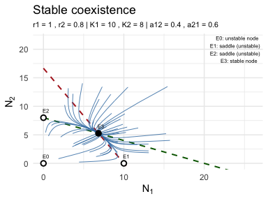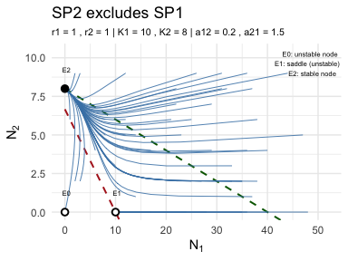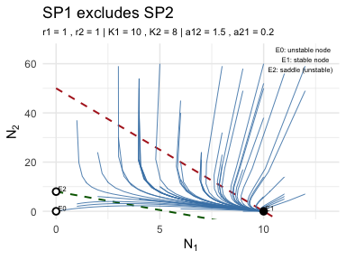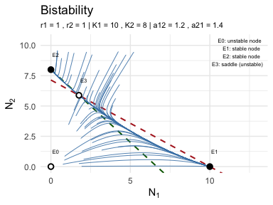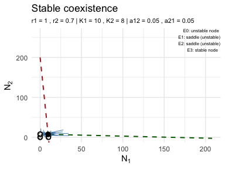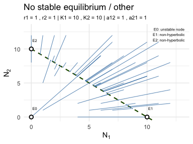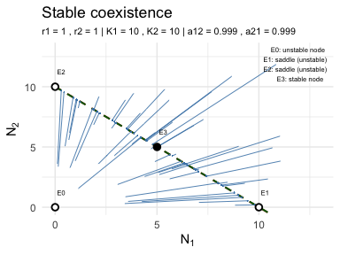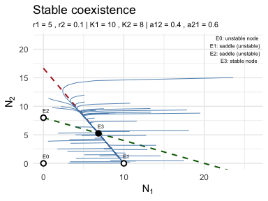

------------------------------------------------------------------------

------------------------------------------------------------------------

## **2. Consumer - resource model**

> This is one of several C-R models that exist.

Let $R$ be resources and $C$ be consumers and $F(R,C)$ be total
consumption rate. And we assume that birth rate of consumer is directly
proportional to amount of resources they consume while death rate
$\delta$ be a constant. Additionally, the resources rejuvenate at a
constant input rate $I$.

So we have the following model :

$$\dfrac{dR}{dt} = I - F(R, C)\\
\dfrac{dC}{dt} = \gamma \cdot F(R,C) - \delta C$$

- Here $\gamma$ is conversion efficiency.

------------------------------------------------------------------------

### Two species C-R competition model

- Assume two species do not interfere with each other directly and only
  compete indirectly by depleting the resource pool.

- We consider Holling type $\mathrm{II}$ functional response for two
  species as it is quite natural way to show consumers eat less in total
  when resources are sparse and they will have upper bound for the
  consumption capacity even when resources are abundant.

- There is intuitive derivation of Holling type $\mathrm{II}$ functional
  response from scratch, using Time budget i.e. by considering
  `searching time` and `handling/eating time`. `work in progress`

$$\dfrac{dR}{dt} = I - \beta_1 \dfrac{R}{R_{01} + R} C_1 - \beta_2 \dfrac{R}{R_{02} + R} C_2 \\
\dfrac{C_1}{dt} = \gamma_1 \beta_1 \dfrac{R}{R_{01} + R} C_1 - \delta_1 C_1 \\
\dfrac{C_2}{dt} = \gamma_2 \beta_2 \dfrac{R}{R_{02} + R} C_2 - \delta_2 C_2 $$

------------------------------------------------------------------------

**Fixed points :**

Solve : $\dot R = 0, \ \ \dot C_1 = 0, \ \ \dot C_2 = 0$

$$R^ \ast \left( \dfrac{\beta_1 C_1}{R_{01} + R^ \ast} -  \dfrac{\beta_2 C_2 }{R_{02} + R^ \ast} \right) = I \\
C_1^ \ast \left(\gamma_1 \beta_1 \dfrac{R^ \ast}{R_{01} + R^ \ast} - \delta_1 \right) = 0 \\
C_2^ \ast \left(\gamma_2 \beta_2 \dfrac{R^ \ast}{R_{02} + R^ \ast} - \delta_2 \right) = 0$$

> One shall solve this by hand to know what exactly going on here.

Solutions :

1.  $C_1^ \ast = 0,\ \ C_2^ \ast = 0 \implies I = 0$, since $I \not = 0$
    in general, this is not a feasible solution

2.  $C_1^ \ast = 0,\ \ C_2^ \ast > 0 \implies$
    $$C_2^ \ast = I \frac{\gamma_2}{\delta_2}, \ \ R^ \ast = \frac{\delta_2 R_{02}}{\gamma_2 \beta_2 - \delta_2} = R_2 ^\ast \text{ (say)}$$

    Note : for valid $R_2 ^ \ast$ we need condition
    $\gamma_2 \beta_2 \gt \delta_2$.

3.  $C_1^ \ast \gt 0,\ \ C_2^ \ast = 0 \implies$
    $$C_1^ \ast = I \frac{\gamma_1}{\delta_1}, \ \ R^ \ast = \frac{\delta_1 R_{01}}{\gamma_1 \beta_1 - \delta_1} = R_1 ^\ast \text{ (say)}$$

    Note : for valid $R_1 ^ \ast$ we need condition
    $\gamma_1 \beta_1 \gt \delta_1$.

4.  $C_1^ \ast > 0,\ \ C_2^ \ast > 0 \implies R_1 ^\ast = R_2^\ast$

    **Final verdict:**

    - Therefore, if $R_{1}^\ast \not = R_{2}^\ast$, **coexistence is not
      possible.**

    - This means a multi-species equilibrium is practically impossible
      in this model where both species are fully dependent on a single
      common resource. `"Complete competitors cannot coexist."`

    - The species with the lower $R_i^\ast$ always excludes the other,
      because it can successfully invade the system even when the rival
      species is already established at its own equilibrium point.

    - `The winner is not the species that eats more when food is abundant, but the one that can survive when food is scarcest.`

------------------------------------------------------------------------

#### Phase Portrait :

``` r
#=====================================================================
param_list = list(
  # R1* = R2*
  params_eq = list(I = 12, b1 = 4, b2 = 3, R01 = 5, R02 = 5,
                   g1 = 1.4, g2 = 1, d1 = 0.5, d2 = 0.267857),
  
  # R1* < R2*
  params_R1 = list(I = 12, b1 = 4, b2 = 3, R01 = 5, R02 = 5,
                   g1 = 1.4, g2 = 1, d1 = 0.5, d2 = 0.8),
  
  # R1* > R2*
  params_R2 = list(I = 12, b1 = 4, b2 = 3, R01 = 5, R02 = 5,
                   g1 = 1.4, g2 = 1, d1 = 1.9, d2 = 0.8)
)
#=====================================================================

for (eg in names(param_list)) {
  params = param_list[[eg]]
  states = states_init_generate(params, 11)
  print(plot_phase_portrait_CR(state = states, params = params, 
                               t = seq(0, 50, length.out = 100)))
}
```

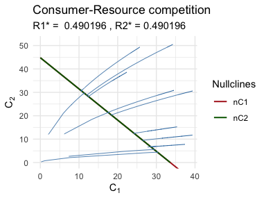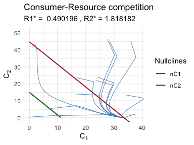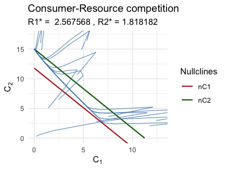

------------------------------------------------------------------------

------------------------------------------------------------------------

## 3. Prey-predator Models

Let $N$ be pray population and $P$ be predator population. Then general
form of continuous prey-predator model can be written as

> $\dfrac{dN}{dt} =$ Growth rate in absence of predator - Death rate due
> to predation

> $\dfrac{dP}{dt} =$ conversion efficiency $\times$ Death rate due to
> predation - Death rate of predators

$$\dfrac{dN}{dt} = f(N) - h(N, P) \\
\dfrac{dP}{dt} = \gamma h(N, P) - \delta(P)$$

------------------------------------------------------------------------

### Different models

> State space : $(N, P)$

#### 1. Lotka-Volterra prey-predator model

- $f(N) = r N$ : Density independent growth rate of pray population in
  absence of predator. Predation is only force that actually will limit
  the population of pray.

- $h(N, P) = \beta N P$ : `Holling type I` (hunger $\to \infty$ as
  $N \to \infty$)

- $\delta(P) = \delta \cdot P$ : Constant per capita death rate

- $r, \beta, \gamma, \delta \gt 0$, otherwise NBS.

$$\dfrac{dN}{dt} = r N - \beta N P \\
\dfrac{dP}{dt} = \gamma \beta N P - \delta P$$

##### **Fixed points:**

- $e_1 = (0, 0)$

- $e_2 = (N = \frac{\delta}{\gamma \beta}, P = \frac{r }{ \beta})$

##### **Jacobian :**

$$\mathbf{J} = 
\begin{bmatrix}
r - \beta P  & -N\beta \\
\gamma \beta P & \gamma \beta N - \delta
\end{bmatrix}$$

##### Stability and Phase portrait :

> Notations : $r$ = r, $\beta =$ b, $\gamma =$ g, $\delta =$ d

``` r
states = data.frame(N = c(0.5, 1.5, 2, 0.3), P = c(0.5, 1.5, 0.5, 2.0))

examples  = list(params_1 = list(r = 1, b = 1, g = 1, d = 1),
                 paramas_2 = list(r = 1.5, b = 0.5, g = 0.8, d = 1.2))

t = seq(0, 50,  length.out = 500)


for (eg in (examples)) {
  print(plot_phase_portrait_PP(models_list$LV, 
                               model_name = 'Lotka Volterra',
                               states = states, params = eg, t = t))
}
```

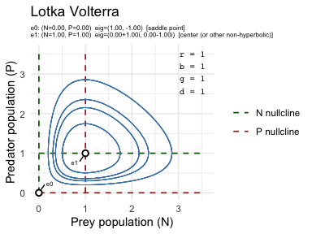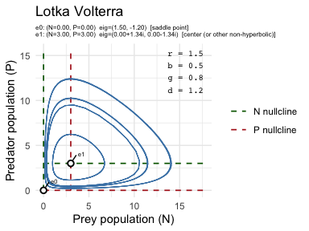

##### Note :

- Always Neutral cycles; no parameter choice changes this.

- Orbit shape depends only on initial condition.

- Lyapunov stable but not asymptotically stable.

------------------------------------------------------------------------

#### 2. Volterra prey-predator model

- $f(N) = rN\left(1-\frac{N}{K}\right)$ : (**Intraspecific
  competition**) Pray population have Logistic growth in absence of
  predator.

- rest it is same as LV model.

$$\dfrac{dN}{dt} = r N\left( 1 - \frac{N}{K}\right) - \beta N P \\
\dfrac{dP}{dt} = \gamma \beta N P - \delta P$$

> The fixed points and Jacobian matrix are omitted here for brevity, as
> their calculation is standard

##### **Stability and Phase portrait :**

> Notations : $r$ = r, $\beta =$ b, $\gamma =$ g, $\delta =$ d, $K =$ K

``` r
states = data.frame(N = c(0.5, 3, 8, 1), P = c(0.5, 3, 1, 0.2))

examples  = list(params_1 = list(r = 1, K = 10,  b = 0.5, g = 0.5, 
                                 d = 1), 
                 paramas_2 = list(r = 1, K = 1.5, b = 0.5, g = 0.5, 
                                  d = 1))

t = seq(0, 50,  length.out = 500)


for (eg in (examples)) {
  print(plot_phase_portrait_PP(models_list$Vt, model_name = 'Voterra',
                               states = states, params = eg, t = t))
}
```

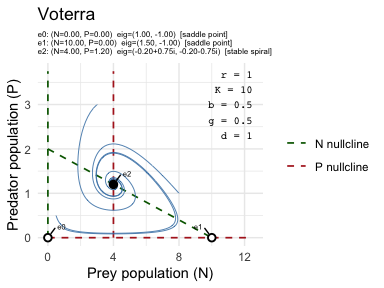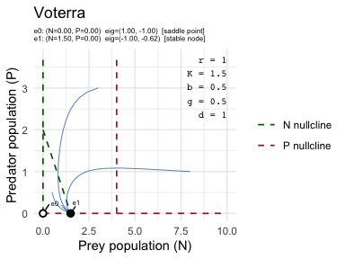

##### Note :

- Coexistence equilibrium `e2`, whenever exist: i.e. $d/(gb) \lt K$ ; it
  is a **stable spiral**, all orbits converge to it.

- $d/(gb) \gt K \implies$ Predator extinction.

- So, overall, small K $\implies$ predator extinction; large K
  $\implies$ coexistence.

------------------------------------------------------------------------

#### 3. Rosenzweig-MacArthur prey-predator model

- $f(N) = rN\left(1-\frac{N}{K}\right)$ : `Logistic growth` of the pray
  in absence of predator.

- $h(N, P) = \beta \dfrac{NP}{N_0 + N}$ : `Holling type II` functional
  response for predation.

- $\delta(p) = \delta \cdot P$ : Constant per capita death rate.

$$\dfrac{dN}{dt} = r N\left( 1 - \frac{N}{K}\right) - \beta \dfrac{NP}{N_0 + N} \\
\dfrac{dP}{dt} = \gamma \beta \dfrac{NP}{N_0 + N} - \delta P$$

> The fixed points and Jacobian matrix are omitted here for brevity, as
> their calculation is standard

##### **Stability and Phase portrait :**

> Notations : $r$ = r, $\beta =$ b, $\gamma =$ g, $\delta =$ d, $K =$ K,
> $N_0 =$ N0

``` r
states = data.frame(N = c(0.5, 3, 8, 1), P = c(0.5, 3, 1, 0.2))

examples = list(
  
  low_k_0   = list(r = 1, K = 2, b = 2, N0 = 10, g = 0.8, 
                   d = 0.5),
  low_K     = list(r = 1, K = 15, b = 2, N0 = 10, g = 0.8, 
                        d = 0.5),
  low_K_1   = list(r = 1, K = 18, b = 2, N0 = 10, g = 0.8, 
                        d = 0.5),
  mid_K     = list(r = 1, K = 19, b = 2, N0 = 10, g = 0.8, 
                 d = 0.5),
  mid_K_1   = list(r = 1, K = 19.5, b = 2, N0 = 10, g = 0.8, 
                 d = 0.5),
  high_K    = list(r = 1, K = 60, b = 2, N0 = 10, g = 0.8, 
                        d = 0.5))

t = seq(0, 300,  length.out = 2000)


for (eg in (examples)) {
  print(plot_phase_portrait_PP(models_list$RM,
                               model_name = 'Rosenzweig-MacArthur',
                               states = states, params = eg, t = t))
}
```

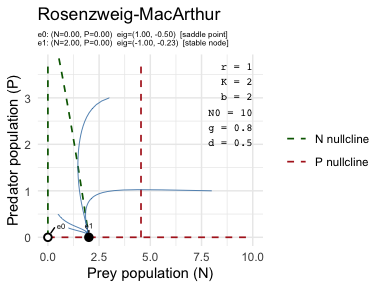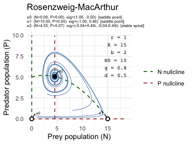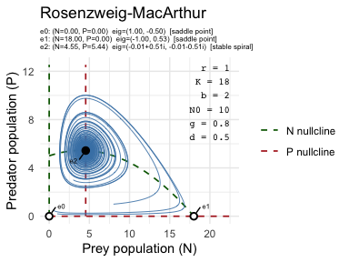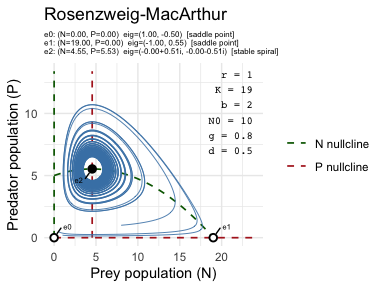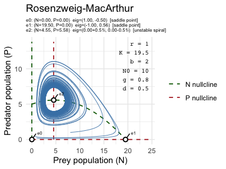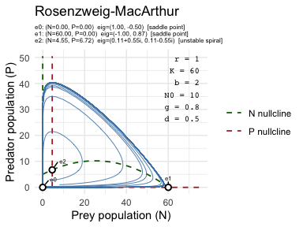

##### Note :

- Roughly speaking

  - `very low K` : gives stable node for prey population and predator go
    extinct.

  <!-- -->

  - `Low K` : Coexistence equilibrium is a **stable spiral**

  - `Mid K` : Slow, barely-decaying oscillations.

    - Eigenvalue real part ≈ 0.\
    - Technically neither stable nor unstable spiral.
    - Approaching the Hopf bifurcation.

  - `High K` Coexistence equilibrium is **unstable spiral**. Orbits
    diverge from equilibrium and settle onto a **stable limit cycle**
    (sustained oscillations, not decay).

- **Increasing** $K$ **destabilizes coexistence.** (opposite effect
  w.r.t. Volterra model).

------------------------------------------------------------------------

------------------------------------------------------------------------

------------------------------------------------------------------------
